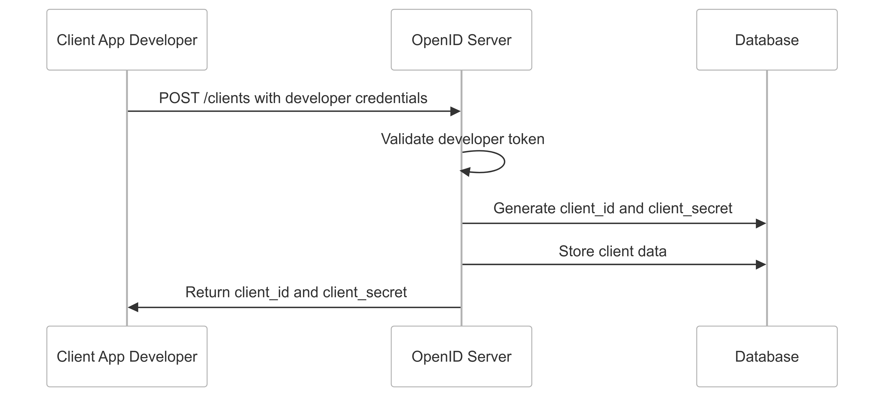
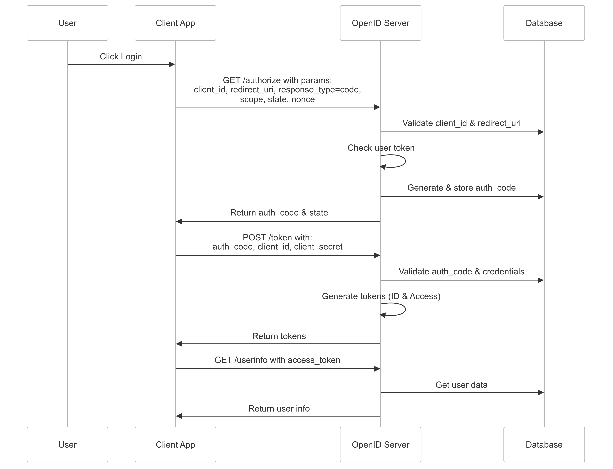

# Praktika OpenID SSO

## Description

**Praktika OpenID SSO** is a project aimed at creating a dummy login system using **OpenID** for users of **Institut Teknologi Sepuluh Nopember (ITS)**. This project enables the integration of a login system into other applications, such as the **Praktika App**, which is a practical application for students. By using **OAuth2** and **OpenID Connect** protocols, the system provides secure and easy authentication for ITS users.

This project leverages the **AdonisJS** framework, **PostgreSQL** as the database, and both **OAuth2** and **OpenID Connect** for building a unified authentication system.

## Key Features

- **Single Sign-On (SSO)**: Users can log in using their ITS accounts.
- **OAuth2 and OpenID Connect**: Secure and standardized authentication protocols.
- **AdonisJS**: Backend framework used for handling the authentication flow.
- **PostgreSQL**: Database used for storing user data and authentication credentials.

## Technologies Used

- **AdonisJS** (Backend Framework)
- **PostgreSQL** (Database)
- **OAuth2** (Authorization Protocol)
- **OpenID Connect** (Authentication Protocol)
- **Node.js** (Runtime Environment)

---

## How to Create a Client (As Shown in the Image)

### Step-by-Step Process:

1. **Access the OAuth2 Admin Console**:

   - Go to the admin console that manages the OAuth2 applications and clients.

2. **Create a New Client**:

   - Click on the button to create a new client in the OAuth2 console. You will be prompted to enter some basic information about the application you are registering.

3. **Enter Application Information**:

   - **Client Name**: The name of the client, usually the name of the application that will use the SSO.
   - **Redirect URI**: The URL to which users will be redirected after a successful login. This is the URL where the client application expects the authentication response to be sent.

   Ensure that the redirect URI matches the one configured in your application settings. This URI is essential for securely completing the authentication process.

4. **Save the Client**:
   - Once the necessary information is filled out, save the new OAuth2 client. You will receive a **Client ID** and **Client Secret**, which are essential for integrating the authentication flow into your application.



---

## Authentication Flow (As Shown in the Image)

### Step-by-Step Authentication Flow:

1. **User Initiates Login**:
   - The user tries to access a resource that requires authentication (for example, logging into the Praktika App).
2. **Redirect to Identity Provider**:

   - The user is redirected to the **MyITS OpenID provider** for authentication. This is where the user will log in using their ITS account credentials.

3. **User Authentication**:

   - The user enters their ITS credentials (username and password). The identity provider authenticates the user and checks for valid credentials.

4. **Authorization Grant**:

   - If the authentication is successful, the identity provider issues an **authorization code** that is sent to the **redirect URI** specified earlier.

5. **Exchange Code for Tokens**:

   - The client application exchanges the authorization code for **access tokens** and **ID tokens** by making a request to the OAuth2 token endpoint.

6. **Access Granted**:

   - Upon successful exchange, the application receives the tokens, which can be used to access the user's information (using the ID token) or make API requests (using the access token).

7. **User Logged In**:
   - The user is successfully logged into the application (e.g., Praktika App), and they can now access protected resources.


This flow ensures secure and standardized authentication, leveraging the power of OAuth2 and OpenID Connect.

---

## Installation and Setup

1. **Clone the Repository**:

   - Clone the repository to your local machine:
     ```bash
     git clone https://github.com/your-repository/myits-openid-sso.git
     cd myits-openid-sso
     ```

2. **Install Dependencies**:

   - Run the following command to install the necessary dependencies:
     ```bash
     npm install
     ```

3. **Configure the Database**:

   - Set up PostgreSQL and configure the database connection in the `.env` file:
     ```env
     DB_CONNECTION=pg
     DB_HOST=127.0.0.1
     DB_PORT=5432
     DB_USER=your-db-user
     DB_PASSWORD=your-db-password
     DB_DATABASE=myits_openid_sso
     ```

4. **Run Migrations**:

   - Apply the database migrations:
     ```bash
     node ace migration:run
     ```

5. **Start the Application**:

   - Start the AdonisJS application:
     ```bash
     npm run dev
     ```

6. **Test the SSO**:
   - Visit the application in your browser, and initiate the login process to verify the SSO functionality.

# API Documentation

For more information about the SSO (Single Sign-On) implementation, you can refer to the official API documentation here:  
[SSO API Documentation](https://web.postman.co/workspace/d25f6e54-2c72-408a-918c-44bcb12ffefe)
